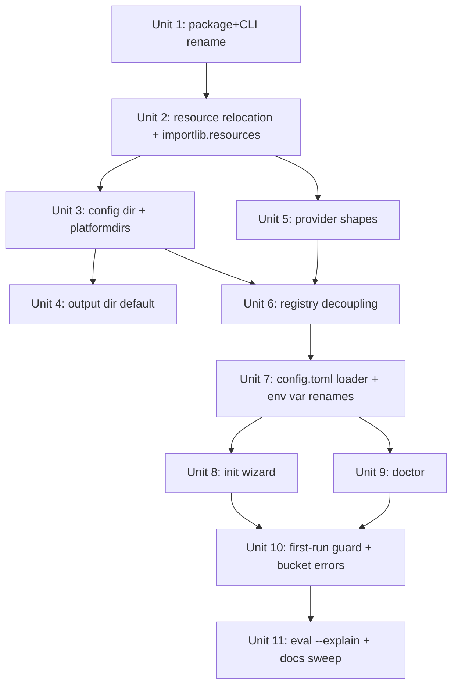

# Install Story — Make resume-cold-read installable by a stranger

## Overview

The `initial-tune-up` branch shipped docs describing an OSS package that a stranger can `uv tool install resume-cold-read` and use without reading source. The code does not yet match. This plan turns the existing repo into that package: packaged resources load via `importlib.resources`, user-persistent state lives in a platform config dir, providers become capability-keyed shapes instead of stringly-typed branches, Azure deployment names leave the source, env var names describe providers instead of maintainer positions, and two new subcommands (`init`, `doctor`) handle first-run UX.

No calibration workflow regresses. `gpt52`, `grok4`, `claude-sonnet`, and `claude-opus` all still run after configuration. The `claude` CLI subprocess path is preserved as-is under a new provider shape — this plan does not migrate Claude to a native SDK.

## Problem Frame

The current code collapses three artifact buckets (ships-with-package / user-owned-persistent / per-invocation) into "stuff in a source tree." Symptoms:

- `_get_project_root()` walks up from `__file__` looking for `pyproject.toml` + `prompts/`, or reads `COLD_READ_HOME`. Works for the maintainer running from a clone; fails for anyone who `uv tool install`s the wheel.
- The `MODELS` registry hardcodes `gpt-52-chat` as the Azure deployment name — a maintainer-specific value a second user will not have.
- Environment variable names (`AZURE_PRIMARY_*`, `AZURE_SECONDARY_*`) describe their position in the maintainer's setup, not the provider.
- `.env.example` is Azure-only in name only — the variable names (`AZURE_PRIMARY_*`) describe maintainer position rather than provider shape, leaving a stranger to guess which of their keys maps to which variable.
- Output writes to `cold-read-output/` relative to CWD. If the user runs from their home dir, the artifact winds up in an unexpected place.
- The `claude` CLI path lives inside `_run_eval` dispatch as a `client_type == "claude_cli"` string check — a hole punched into the "OpenAI-client dispatch" shape.
- No error distinguishes "broken install" from "broken config" from "bad CLI argument" — all failures look the same to a confused first-time user.

See origin: `docs/brainstorms/2026-04-14-install-story-requirements.md`. All product decisions are resolved; this plan settles the architectural and sequencing questions the origin flagged as `Deferred to Planning`.

## Requirements Trace

Each requirement maps to one or more implementation units below.

- **R1.** Package + CLI rename to `resume-cold-read` → Unit 1
- **R2.** Packaged resources via `importlib.resources`; delete `_get_project_root()` and `COLD_READ_HOME` → Unit 2
- **R3.** User config at `~/.config/resume-cold-read/` via `platformdirs` → Unit 3
- **R4.** Default output at `~/.local/share/resume-cold-read/runs/`, dated filename pattern → Unit 4
- **R5.** Provider shapes replacing `client_type` branches → Unit 5
- **R6.** Model alias ⟷ deployment-name decoupling; deployments live in `config.toml` → Unit 6
- **R7.** `default_model` in `config.toml`; set by `init` → Unit 7 (registry/config), Unit 8 (init)
- **R8.** Env var renames; retire `AZURE_PRIMARY_*` / `AZURE_SECONDARY_*` → Unit 5 (shape definitions), Unit 7 (loader), Unit 11 (docs)
- **R9.** All four registered models keep working → validated across Units 5, 6, 7 and in verification
- **R10.** `resume-cold-read init` wizard with per-provider loop and live credential test → Unit 8
- **R11.** Azure deployments listing during `init` with graceful fallback → Unit 8
- **R12.** `resume-cold-read doctor` command with four-section checklist → Unit 9
- **R13.** First-run-with-no-config exits non-zero with pointer to `init` → Unit 10
- **R14.** Error messages name the artifact bucket and suggest the fix path → Unit 10
- **R15.** `eval --explain` dry-runs prompt composition and exits → Unit 11

## Scope Boundaries

The following are explicitly **not** part of this work:

- Structured-response JSON contract and run-as-directory output
- Auto-graded calibration against an answer key
- Meta-eval fixture set / regression scoring on prompt changes
- Watch mode, application-folder reframe, community profile registry, keychain credentials
- Native OpenAI SDK provider (the `openai` shape is a reserved placeholder; shipping path goes through `azure-openai` until the native shape is calibrated)
- Native Anthropic SDK provider (the `anthropic` shape is a reserved placeholder only)
- Gemini support
- `resume-cold-read` rasterization-step replacement (`pdftoppm` stays a prerequisite)

### Deferred to Separate Tasks

- **PyPI publish workflow itself** (classifiers, release automation, trusted publisher): separate PR after install-story code lands and is verified locally. This plan produces a wheel that *could* be published but does not set up the release pipeline.
- **Meridian AI demo-universe expansion** beyond what already ships in `examples/`: not in scope here.

## Context & Research

### Relevant Code and Patterns

- `src/cold_read/eval.py` — contains everything: model registry, client builders, prompt composition, CLI command. This file gets carved into smaller modules.
- `src/cold_read/cli.py` — thin Typer app. Gains new commands via `register_commands()`.
- `src/cold_read/eval.py:48-65` — `_get_project_root()` — deleted in Unit 2.
- `src/cold_read/eval.py:20-45` — `MODELS` dict — rewritten in Units 5 and 6.
- `src/cold_read/eval.py:223-247` — `_build_client()` — replaced by provider-shape dispatch in Unit 5.
- `src/cold_read/eval.py:319-381` — `_run_eval_claude_cli()` — preserved, becomes the `claude-cli` shape's `run()` implementation.
- `prompts/` and `calibration/` at repo root — relocated under `src/cold_read/_resources/` in Unit 2.
- `prompts/manifest.json` — source of truth for phase config; `fixed_images` paths are rewritten relative to the new resources root.

### Institutional Learnings

- **Three-bucket stance** (bucket 1: ships-with-package, bucket 2: user-owned-persistent, bucket 3: per-invocation) from `CLAUDE.md`. A feature that reads bucket-2 data from a bucket-1 location is a bug. Error messages and loaders respect bucket boundaries.
- **Multi-provider is load-bearing for calibration**, not a complexity tax. New vision models ship continuously; the calibration suite against each is how prompt quality stays credible. Dropping providers as "simplification" is the wrong simplification.
- **Wait for three variants before abstracting** (CLAUDE.md). This plan *does* abstract (provider shapes) because five variants already exist (`openai`, `azure-openai`, `azure-maas`, `claude-cli`, reserved `anthropic`). Other patterns (loaders, config writers) stay concrete until a third case shows up.

### External References

- `importlib.resources` — stdlib, stable since 3.9. Use `files(package).joinpath(...).read_text()` form for this codebase (3.12+).
- `platformdirs` — thin wrapper over XDG / macOS `Application Support` / Windows `APPDATA`. Chosen over `appdirs` (unmaintained).
- Azure OpenAI `GET {endpoint}/openai/deployments?api-version=...` — returns deployment metadata including the underlying `model` field. Not exposed through the `openai` Python SDK client; requires raw HTTP. See Key Technical Decisions.
- `typer` + `rich` — already dependencies. `rich.prompt.Prompt.ask` and `rich.console.Console` cover the wizard UX without new packages.

## Key Technical Decisions

- **Physically relocate `prompts/` and `calibration/` to `src/cold_read/_resources/`.** Beats `hatch force-include` for clarity and IDE navigation. Relocation is a one-time cost; force-include is permanent config complexity. Underscore prefix signals "packaged internal," not "user-editable."
- **Provider shape protocol is a typed `dataclass` with a `run(...)` callable plus a `credential_test()` callable, not a class hierarchy.** Three concrete shapes ship in this pass (`azure-openai`, `azure-maas`, `claude-cli`); two slots (`openai`, `anthropic`) are reserved as NotImplementedError placeholders so the registry shape is stable when native-SDK implementations land. The signature is `run(prompt_text: str, images: list[Path], extras: dict) -> EvalResult` — each shape owns its own encoding. OpenAI-SDK shapes read the paths and base64-encode them into `messages`; `claude-cli` writes paths as strings into the prompt and lets the subprocess Read them off disk. The protocol operates at pre-encoding level so one shape's format never leaks into another's.
- **Azure-first for the calibrated default.** `gpt52` on `azure-openai` is the `default_model` a new user lands on after `init`. OpenAI-native and native Anthropic are deferred until they are calibrated against the answer key; until then they are reserved shapes, not shipping paths.
- **Azure deployments listing uses raw `httpx`**, not the `openai` SDK. The SDK's `models.list()` against an Azure endpoint returns available base models, not user-created deployments. Pin the `api-version` query parameter in a single module-level constant so it can be bumped without grepping.
- **Vision-capable filtering in `init` uses a small hardcoded allow-list of model-family prefixes** (`gpt-4o`, `gpt-4.1`, `gpt-5`, `gpt-5.1`, `gpt-5.2`, etc.). Azure returns the underlying model name in the deployment metadata. A field-based capability check would be more robust if Azure exposed one; it does not, and the allow-list is easy to extend.
- **Live credential test is per-shape.** `azure-openai`: cheap `client.models.list()` (returns something or raises). `azure-maas`: a single-token echo completion against the configured deployment — the MaaS endpoint does not reliably expose `models`. `claude-cli`: `subprocess.run(["claude", "--version"], timeout=5)`. Reserved shapes (`openai`, `anthropic`) have no credential test. Per-shape is simpler than a unified "health check" abstraction over three dissimilar shapes.
- **`.env` precedence.** Load order: user config dir first, then CWD `.env` to allow dev overrides, then process environment (which wins). Documented in `doctor` output. `python-dotenv`'s `override=False` on the second call preserves this.
- **No v0.1 migration path.** The project is pre-1.0 and the installed base is effectively the maintainer. If `AZURE_PRIMARY_API_KEY` still exists in a user's environment, it is silently ignored; `doctor` will flag missing `AZURE_OPENAI_API_KEY` clearly enough.
- **Refactor order: config + resources → provider shapes → registry decoupling → UX commands → error/explain polish.** Foundation first so each subsequent unit has a stable surface to build on. See sequencing diagram.
- **`init` writes `.env` and `config.toml` via rewrite-then-rename.** Read the existing file, merge the wizard's additions, create the temp file in the same dir via `tempfile.mkstemp(dir=config_dir)` (which opens the fd 0o600) or equivalently `os.open(tmp, os.O_WRONLY|os.O_CREAT|os.O_EXCL, 0o600)`, write, then `os.replace` into place. Avoids half-written config if interrupted and guarantees `.env` lands at mode 0600 regardless of the user's umask. No file locking — single-user, interactive tool.
- **`config.toml` is read with `tomllib` (stdlib) and written via a hand-rolled minimal writer.** No `tomli-w` dependency; the schema is small and flat. If it grows, we revisit.
- **Package + command both named `resume-cold-read`.** The short `cold-read` alias is not preserved. Consistency with the install name is worth the docs sweep.

## Open Questions

### Resolved During Planning

- **Physical relocation vs. `force-include`** for packaged resources → physical relocation to `src/cold_read/_resources/`.
- **Provider protocol shape** → typed dataclass + callables, not class hierarchy.
- **Azure deployments listing mechanism** → raw `httpx` with pinned API version.
- **Vision-capability detection** → hardcoded model-family allow-list.
- **Live credential test shape** → per-provider implementation; no unified abstraction.
- **Migration path from v0.1** → none needed.
- **Refactor sequencing** → foundation first (resources + config), then provider model, then UX commands.

### Deferred to Implementation

- **Exact `httpx` error-class-to-user-message mapping** for Azure deployments listing. Falling back to free-form entry on any failure is the behavior; the categorization of failure messages (auth vs. network vs. bad endpoint shape) can be refined once real errors surface during wizard testing.
- **Whether `doctor` should verify the configured deployment still exists** on Azure, or stop at "credentials resolve." Current decision: stop at credentials — verifying deployments-still-exist is an extra round-trip that rarely catches anything. Revisit if wizard-configured users see drift.
- **How `--explain` formats section boundaries for JD-mode two-pass.** Prototype during implementation; simplest thing that names each source file per section is fine.
- **Whether to retire the `phase2-pm` / `phase2-swe` sample prompts** in favor of pure `--jd` mode. Out of scope here; they continue to work, just not the headline story.

## Output Structure

The refactor creates a handful of new modules under `src/cold_read/` and relocates packaged resources. End state:

```
src/cold_read/
├── __init__.py
├── cli.py                      # Thin Typer app; registers eval/init/doctor
├── config.py                   # platformdirs paths, .env precedence, config.toml read/write
├── errors.py                   # Bucket-labeled exceptions + formatter
├── eval.py                     # Slimmed: composes prompts, runs pipeline, saves output
├── output.py                   # Output-path resolution + filename pattern
├── prompts.py                  # importlib.resources readers for packaged prompts/calibration
├── providers/
│   ├── __init__.py             # ProviderShape dataclass + SHAPES registry
│   ├── azure_maas.py           # azure-maas shape impl
│   ├── azure_openai.py         # azure-openai shape impl (calibrated default)
│   └── claude_cli.py           # claude-cli shape impl (preserves current subprocess path)
│   # `openai` and `anthropic` shapes live in providers/__init__.py as
│   # NotImplementedError placeholders — no module files until they're real.
├── registry.py                 # MODELS alias → shape map; config.toml deployment overrides
├── wizard.py                   # resume-cold-read init
├── doctor.py                   # resume-cold-read doctor
└── _resources/
    ├── prompts/                # Moved from repo-root prompts/
    │   ├── manifest.json
    │   ├── preamble.md
    │   ├── task-jd-vision.md
    │   ├── task-jd-eval.md
    │   ├── calibration-prompt.md
    │   ├── phase1-visual.md
    │   ├── phase2-pm.md
    │   └── phase2-swe.md
    └── calibration/            # Moved from repo-root calibration/
        ├── answer-key.md
        └── images/
            ├── page-1.png
            └── page-2.png
```

This is a scope declaration, not a constraint. If implementation reveals that `providers/` is over-structured for four shapes, collapsing them to a single `providers.py` is fine — the per-unit `**Files:**` sections stay authoritative.

## High-Level Technical Design

> *This illustrates the intended approach and is directional guidance for review, not implementation specification. The implementing agent should treat it as context, not code to reproduce.*

### Provider shape dispatch

The `client_type` string branch is replaced by a shape registry. Each shape declares its credential fields, its runner, and its credential-test function:

```
ProviderShape (dataclass)
  name: "openai" | "azure-openai" | "azure-maas" | "claude-cli" | "anthropic"
  credential_fields: list[EnvField]       # e.g. [AZURE_OPENAI_API_KEY, AZURE_OPENAI_ENDPOINT] or [] for claude-cli
  run(model_config, prompt, images) -> EvalResult
  credential_test(config) -> CredentialTestResult

SHAPES: dict[str, ProviderShape] = { ... }

MODELS (registry):
  "gpt52":        {shape: "azure-openai", reasoning: true, api_version: "2024-12-01-preview"}
  "grok4":        {shape: "azure-maas"}
  "claude-sonnet":{shape: "claude-cli",   claude_alias: "sonnet"}
  "claude-opus":  {shape: "claude-cli",   claude_alias: "opus"}
  # No new aliases this pass. `openai` and `anthropic` shapes exist in SHAPES but
  # have no registered aliases until they are calibrated.
```

Deployment names are looked up from `config.toml` at resolve time, not baked into `MODELS`:

```
[providers.azure-openai]
deployment_map = { gpt52 = "gpt-52-chat" }

[providers.azure-maas]
deployment_map = { grok4 = "grok-4-fast-reasoning" }

default_model = "gpt52"
```

### Sequencing



Units 3 and 5 are independent after Unit 2 lands and can proceed in parallel if desired. Everything downstream of Unit 6 is linearly dependent.

## Implementation Units

- [ ] **Unit 1: Rename package and CLI entry point to `resume-cold-read`**

**Goal:** The PyPI package name and the installed command both become `resume-cold-read`. No behavioral change yet — this is a rename pass so later units don't need to re-touch `pyproject.toml` or docs.

**Requirements:** R1

**Dependencies:** None

**Files:**
- Modify: `pyproject.toml`
- Modify: `README.md`
- Modify: `CLAUDE.md`
- Modify: `src/cold_read/cli.py` (help strings only)
- Test: none (rename-only; covered by verification)

**Approach:**
- Change `[project]` `name` from `cold-read` to `resume-cold-read`.
- Change `[project.scripts]` from `cold-read = "cold_read.cli:app"` to `resume-cold-read = "cold_read.cli:app"`.
- Do **not** rename the Python package `cold_read` → `resume_cold_read`. Hyphens are not legal in Python package names; the import-name stays `cold_read`. Only the distribution name and console script change.
- Sweep docs: replace `cold-read` with `resume-cold-read` in README invocation examples, CLAUDE.md references, help strings. Leave historical mentions in `docs/brainstorms/` and `docs/ideation/` untouched (they are dated artifacts).

**Patterns to follow:**
- Existing `[project.scripts]` convention in `pyproject.toml`.

**Test scenarios:**
- Test expectation: none — rename is verified by building the wheel and confirming the entry point.

**Verification:**
- `uv build` produces a wheel whose `entry_points.txt` contains `resume-cold-read = cold_read.cli:app`.
- `uv tool install --from dist/<wheel> resume-cold-read` installs a `resume-cold-read` command on PATH that runs `--help` successfully.
- `rg -i 'cold-read'` in README.md and CLAUDE.md returns only `resume-cold-read` occurrences.

---

- [ ] **Unit 2: Ship packaged resources in the wheel; load via `importlib.resources`**

**Goal:** Delete `_get_project_root()` and `COLD_READ_HOME`. All code paths that currently read `prompts/` or `calibration/` relative to the project root read them from within the installed package via `importlib.resources.files("cold_read._resources")`.

**Requirements:** R2

**Dependencies:** Unit 1

**Files:**
- Create: `src/cold_read/_resources/` (directory with relocated content)
- Move: `prompts/` → `src/cold_read/_resources/prompts/`
- Move: `calibration/` → `src/cold_read/_resources/calibration/`
- Create: `src/cold_read/prompts.py` (loader module using `importlib.resources`)
- Modify: `src/cold_read/eval.py` (delete `_get_project_root()`, `_load_manifest()`, `_load_prompt()`, `_load_prompt_file()`, `_get_fixed_images()`; route callers through `prompts.py`)
- Modify: `src/cold_read/_resources/prompts/manifest.json` (rewrite `fixed_images` paths to be relative to `_resources/`, e.g. `calibration/images/page-1.png`)
- Modify: `pyproject.toml` (ensure wheel includes `*.md`, `*.json`, `*.png` under `src/cold_read/_resources/`)
- Test: `tests/test_prompts_loader.py`

**Approach:**
- `prompts.py` exposes: `load_manifest()`, `load_prompt(phase_id)`, `load_prompt_file(filename)`, `get_fixed_images(phase_id) -> list[Path] | None`. The fixed-image loader materializes packaged PNGs to a temp file using `importlib.resources.as_file` (since `pdftoppm`'s downstream consumer expects real filesystem paths).
- Hatch wheel-target config: add `[tool.hatch.build.targets.wheel.force-include]` mapping or rely on `packages = ["src/cold_read"]` picking up non-`.py` files — verify empirically, since hatchling ships Python files by default but can miss data files. Explicitly add an `artifacts` or `force-include` entry if the first build omits PNGs.
- All call sites in `eval.py` that went through `_get_project_root()` now import from `prompts.py`.

**Patterns to follow:**
- Existing `_load_manifest()` / `_load_prompt()` structure — same functions, different backing store.

**Test scenarios:**
- Happy path: `load_prompt("phase1-visual")` returns non-empty string containing known sentinel from `phase1-visual.md`.
- Happy path: `load_manifest()` returns dict with a `phases` key.
- Happy path: `get_fixed_images("calibration")` returns two existing `Path` objects pointing at readable PNG files.
- Edge case: `load_prompt("does-not-exist")` raises a clear error naming the unknown phase and listing available ids.
- Integration: wheel built from the repo, installed in a throwaway venv, and loaded via `import cold_read.prompts; cold_read.prompts.load_manifest()` succeeds from a CWD outside the repo (i.e., the `tmp/` directory).

**Verification:**
- `rg -n '_get_project_root|COLD_READ_HOME'` on `src/` returns nothing.
- `uv pip install dist/<wheel>` into a fresh venv, `cd /tmp`, `python -c "from cold_read.prompts import load_manifest; print(load_manifest())"` prints the manifest.
- Full eval path still works for at least one non-Claude model after this unit lands (run one `phase1-visual` against `gpt52` — must complete).

---

- [ ] **Unit 3: User config directory via `platformdirs`**

**Goal:** Introduce `~/.config/resume-cold-read/` (via `platformdirs.user_config_dir`) as the home for `.env`, `config.toml`, and `companies/`. `.env` load precedence: config-dir first, then CWD, then process env. `config.toml` reads a `default_model` and per-provider `deployment_map`s; writes via a rewrite-then-rename dance.

**Requirements:** R3, R8 (loader side)

**Dependencies:** Unit 2

**Files:**
- Create: `src/cold_read/config.py`
- Modify: `src/cold_read/eval.py` (replace module-level `load_dotenv()` call and inline company-dossier resolution with calls into `config.py`)
- Modify: `pyproject.toml` (add `platformdirs` to `dependencies`)
- Test: `tests/test_config.py`

**Approach:**
- `config.py` exposes:
  - `config_dir() -> Path` — `platformdirs.user_config_path("resume-cold-read")`. If missing, created via `path.mkdir(mode=0o700, parents=True, exist_ok=True)` followed by an explicit `os.chmod(path, 0o700)` (mkdir's `mode` is masked by umask, so the chmod is the authoritative step).
  - `data_dir() -> Path` — `platformdirs.user_data_path("resume-cold-read")`, created if missing.
  - `load_env()` — loads `config_dir()/".env"` then CWD `.env`, without clobbering process env (the second and third layers use `override=False`).
  - `read_config() -> Config` where `Config` is a dataclass with `default_model: str | None` and `providers: dict[str, ProviderConfig]`, each `ProviderConfig` holding `deployment_map: dict[str, str]` and any shape-specific fields.
  - `write_config(config: Config)` — rewrite-then-rename.
  - `resolve_company(slug_or_path: str) -> Path | None` — if the input resolves to an existing file on disk, return it. Otherwise treat the input as a slug: validate against `^[a-z0-9][a-z0-9_-]*$` (no dots, no slashes, no path separators) and reject anything else; join into `config_dir()/"companies"/f"{slug}.md"` and confirm the resolved path is still under `companies/` via `resolved.resolve().is_relative_to(companies_dir.resolve())` before returning it; else return `None` with a caller-handled warning. **This is a bucket-2 resolver and must never fall back to the packaged `prompts/` directory, and the slug branch must never escape `companies/` via `..` or absolute-path components.**
- `load_env()` is called once at CLI entry, before any command runs.

**Patterns to follow:**
- `dotenv.load_dotenv(path, override=False)` layered calls — the same pattern used in most `python-dotenv` projects.

**Test scenarios:**
- Happy path: With a tmpdir-faked config dir, writing a `config.toml` with `default_model = "gpt52"` and reading it back returns the same value.
- Happy path: `.env` in faked config dir sets `AZURE_OPENAI_API_KEY`; process env does not contain it beforehand; after `load_env()` it is set.
- Edge case: CWD `.env` and config-dir `.env` both define `AZURE_OPENAI_API_KEY` — config-dir value wins (loaded first; second call has `override=False`).
- Edge case: Process env already has `AZURE_OPENAI_API_KEY`; neither file layer clobbers it.
- Error path: `config_dir()` path does not exist and `mkdir(parents=True, exist_ok=True)` creates it.
- Integration: `resolve_company("meridian-ai")` returns the config-dir path when the file exists there; returns `None` when it doesn't; given an absolute path to an existing file, returns that path; given a slug pointing at a non-existent file, returns `None` (does **not** search packaged prompts).

**Verification:**
- `platformdirs` appears in `uv.lock`.
- Running any CLI command on a machine with no config dir creates it with correct permissions (0700 for the dir, 0600 for `.env`).

---

- [ ] **Unit 4: Default output directory and dated filename pattern**

**Goal:** When `--output` is not passed, eval output writes to `platformdirs.user_data_path("resume-cold-read") / "runs"` with filename `YYYY-MM-DD-<input-stem>-<short-id>.md`. No default code path writes to CWD.

**Requirements:** R4

**Dependencies:** Unit 3

**Files:**
- Create: `src/cold_read/output.py`
- Modify: `src/cold_read/eval.py` (replace the two inline `Path("cold-read-output")` constructions)
- Test: `tests/test_output.py`

**Approach:**
- `output.py` exposes `default_output_path(input_stem: str, ext: str = ".md") -> Path` and `save_individual(...)`.
- Short-id is a 6-hex-char `secrets.token_hex(3)` so filenames never collide within the same day.
- `eval_command` uses `default_output_path` when `--output` is omitted; passes user-provided path through unchanged otherwise.
- `_save_result()` moves to `output.save_individual()` and writes under the same dated directory.

**Patterns to follow:**
- Existing filename-composition logic in `_save_result()` — replaced in-place.

**Test scenarios:**
- Happy path: `default_output_path("resume")` returns a path under the user data dir ending in `.md` with a dated prefix and a 6-hex-char suffix.
- Edge case: Two sequential calls within the same second produce different filenames (short-id collision avoidance).
- Edge case: `--output /tmp/foo.md` is used verbatim; default-output logic is not invoked.
- Integration: An eval run with no `--output` produces a file under `platformdirs.user_data_path / "runs"` and not under CWD.

**Verification:**
- `rg -n 'cold-read-output'` returns nothing in `src/`.
- A run from `/tmp` produces artifacts under `~/.local/share/resume-cold-read/runs/` (or macOS equivalent).

---

- [ ] **Unit 5: Provider shapes replace `client_type` dispatch**

**Goal:** The five provider shapes (`openai`, `azure-openai`, `azure-maas`, `claude-cli`, reserved `anthropic`) are defined as typed dataclasses with `run()` and `credential_test()` callables. The `_build_client()` + `client_type`-string dispatch is deleted. Behavior is preserved for all four existing registered models.

**Requirements:** R5, R8 (shape-side env var definitions), R9

**Dependencies:** Unit 2 (for resource loads inside runners)

**Files:**
- Create: `src/cold_read/providers/__init__.py` (ProviderShape dataclass, EnvField, SHAPES registry including reserved `openai` and `anthropic` entries)
- Create: `src/cold_read/providers/azure_openai.py`
- Create: `src/cold_read/providers/azure_maas.py`
- Create: `src/cold_read/providers/claude_cli.py`
- Modify: `src/cold_read/eval.py` (delete `_build_client`, `_run_eval`, `_run_eval_claude_cli` inline implementations; replace with `shape.run(...)`)
- Test: `tests/providers/test_azure_openai.py`
- Test: `tests/providers/test_azure_maas.py`
- Test: `tests/providers/test_claude_cli.py`

**Approach:**
- `ProviderShape` dataclass fields: `name`, `credential_fields: list[EnvField]`, `run(prompt_text: str, images: list[Path], extras: dict) -> EvalResult`, `credential_test(...) -> CredentialTestResult`, `requires_deployment_map: bool`. `EnvField` is `(name: str, description: str, secret: bool)` for wizard/doctor UX. Each shape owns its own image encoding: OpenAI-SDK shapes base64 the paths into `messages`; `claude-cli` writes paths as strings into the prompt. The dataclass itself never handles pre-encoded messages — that keeps any one shape's format from leaking into another's signature.
- `azure-openai` shape: `[AZURE_OPENAI_API_KEY, AZURE_OPENAI_ENDPOINT]`; `run()` uses `AzureOpenAI(...)` with deployment-name resolved by `registry.resolve()` from `config.toml`; test is `client.models.list()`.
- `azure-maas` shape: `[AZURE_MAAS_API_KEY, AZURE_MAAS_ENDPOINT]`; `run()` is the existing MaaS code (OpenAI client over the `/openai/v1/` suffix); test is a 1-token echo completion.
- `claude-cli` shape: `credential_fields = []`; `run()` is the existing `_run_eval_claude_cli` logic moved wholesale; test is `subprocess.run(["claude", "--version"], timeout=5)`. The shape preserves every flag currently passed to `claude` — `--setting-sources`, `--disable-slash-commands`, `--no-session-persistence`, `--dangerously-skip-permissions`, and the `CLAUDECODE` env-var strip.
- Reserved `openai` shape: registered in `SHAPES` with a `run()` that raises `NotImplementedError("openai shape is reserved; use azure-openai for calibrated GPT models")`. No other wiring. Promoted to a real shape when OpenAI-native passes calibration.
- Reserved `anthropic` shape: registered in `SHAPES` with a `run()` that raises `NotImplementedError("anthropic shape is reserved; use claude-cli")`. No other wiring.

**Execution note:** Write the shape-level tests first for each non-Claude shape (mocking the OpenAI client) to lock in the run/credential-test contract before deleting the current inline implementation. This is a mechanical refactor with meaningful surface-area risk; behavior parity is the only thing keeping this unit honest.

**Patterns to follow:**
- Current `_build_client` / `_run_eval` / `_run_eval_claude_cli` in `eval.py` — these move into shape modules largely verbatim, just reorganized behind `run()`.

**Test scenarios:**
- Happy path (azure-openai shape): deployment-name from config is passed as `model` on the chat-completions call; image paths are base64-encoded into `messages` inside `run()`.
- Happy path (azure-maas shape): `endpoint.rstrip("/") + "/openai/v1/"` is used as `base_url`.
- Happy path (claude-cli shape): subprocess is invoked with model alias `sonnet` or `opus`, image paths are written as strings into the prompt (not base64), the `CLAUDECODE` env var is stripped, and the stdout JSON `result` field is returned as `content`.
- Edge case (any shape): when `credential_fields` are missing from env, `run()` raises a clear error naming the missing env var by its documented name (e.g. `AZURE_OPENAI_API_KEY`, not `api_key_env`).
- Edge case (reserved shapes): `SHAPES["openai"].run(...)` and `SHAPES["anthropic"].run(...)` raise `NotImplementedError` with the documented message; neither is reachable via any registered alias in `MODELS`.
- Error path (azure-maas credential test): completion returns a 401; `credential_test()` returns a `CredentialTestResult(ok=False, reason="...")` instead of raising.
- Error path (claude-cli credential test): `claude` not on PATH → `FileNotFoundError` → `CredentialTestResult(ok=False, reason="`claude` CLI not found on PATH")`.
- Integration: `shape.run()` for `azure-openai` called end-to-end against a recorded/VCR'd fixture produces an `EvalResult` with non-empty `content` and token counts.

**Verification:**
- `rg -n 'client_type|_build_client|_run_eval_claude_cli' src/` returns no hits.
- All four existing registered models (`gpt52`, `grok4`, `claude-sonnet`, `claude-opus`) still run to completion against their real endpoints after wiring through the new shapes. Manual smoke: run `--prompt phase1-visual` against each (where creds available).

---

- [ ] **Unit 6: Decouple model registry from Azure deployment names**

**Goal:** `MODELS` maps alias → shape + shape-specific defaults, with zero hardcoded Azure deployment names. At resolve time, the deployment name for an alias on a deployment-map-requiring shape is looked up from `config.toml`.

**Requirements:** R6, R7 (registry side)

**Dependencies:** Units 3 and 5

**Files:**
- Create: `src/cold_read/registry.py`
- Modify: `src/cold_read/eval.py` (import `MODELS` from `registry.py`; remove the inline dict)
- Test: `tests/test_registry.py`

**Approach:**
- `registry.py` defines `MODELS: dict[str, ModelEntry]` where `ModelEntry` holds `shape: str`, `extras: dict` (shape-specific: `api_version`, `reasoning`, `claude_alias`, `max_images`), plus the method `resolve(alias, config) -> ResolvedModel`.
- `resolve()` reads the shape from `MODELS[alias]`, looks up the deployment name in `config.providers[shape].deployment_map.get(alias)`. If the shape `requires_deployment_map` and the lookup fails, raises a clear error directing the user to `resume-cold-read init` or to edit `config.toml` manually.
- Claude-cli shape uses `extras["claude_alias"]` directly; no deployment map.
- Reserved shapes (`openai`, `anthropic`) have no registered aliases, so `resolve()` never returns them; `--list-models` hides them from output.

**Patterns to follow:**
- Existing `MODELS` dict shape — trimmed and reorganized, not re-invented.

**Test scenarios:**
- Happy path: `resolve("gpt52", config_with_map)` returns a `ResolvedModel` with the configured deployment name.
- Happy path: `resolve("claude-sonnet", any_config)` returns a `ResolvedModel` with `claude_alias="sonnet"` and no deployment-name dependency.
- Edge case: `resolve("grok4", config_without_map)` raises an error naming the missing `[providers.azure-maas] deployment_map.grok4` entry and suggesting `resume-cold-read init` or manual config edit.
- Edge case: `resolve("unknown-alias", config)` raises with the set of known aliases listed.
- Integration: with a real `~/.config/resume-cold-read/config.toml` containing deployment maps for `gpt52` and `grok4`, `--list-models` output is identical in shape to the pre-refactor output.

**Verification:**
- `rg -n 'gpt-52-chat|grok-4-fast-reasoning' src/` returns no hits (deployment names live only in `config.toml`, never in code).

---

- [ ] **Unit 7: Retire old env var names; wire new ones end-to-end**

**Goal:** `AZURE_PRIMARY_*` and `AZURE_SECONDARY_*` are gone. `.env.example` at repo root documents `AZURE_OPENAI_API_KEY` + `AZURE_OPENAI_ENDPOINT` and `AZURE_MAAS_API_KEY` + `AZURE_MAAS_ENDPOINT`, grouped by provider shape with one-line comments per group. No silent fallback to the old names. `OPENAI_API_KEY` is not documented — the `openai` shape is reserved and has no registered aliases this pass.

**Requirements:** R8, R7 (config loader side)

**Dependencies:** Unit 6

**Files:**
- Modify: `.env.example`
- Modify: `src/cold_read/providers/azure_openai.py` (env-field names)
- Modify: `src/cold_read/providers/azure_maas.py` (env-field names)
- Modify: `README.md` (Configure section)
- Test: none (covered by shape tests in Unit 5 + doctor output in Unit 9)

**Approach:**
- Update `.env.example` with the four new variable names (two per Azure shape), grouped by provider shape, with one-line comments per group.
- Shape `credential_fields` already use the new names (defined in Unit 5); this unit's job is closing the gap between code and user-facing docs, plus the deliberate decision to *not* fallback to old names.
- `doctor` in Unit 9 notices old-name presence and recommends renaming (explicit deprecation signal without silent fallback).

**Patterns to follow:**
- None — this is a rename sweep with a docs update.

**Test scenarios:**
- Test expectation: none — covered transitively by Unit 5 shape tests and Unit 9 doctor scenarios.

**Verification:**
- `rg -n 'AZURE_PRIMARY|AZURE_SECONDARY' src/ .env.example README.md` returns no hits.

---

- [ ] **Unit 8: `resume-cold-read init` wizard**

**Goal:** Interactive wizard that writes `~/.config/resume-cold-read/.env` and `~/.config/resume-cold-read/config.toml` based on user selections. Supports a per-provider loop, does a live credential test before writing, and for Azure OpenAI queries `/openai/deployments` with graceful free-form fallback.

**Requirements:** R10, R11, R7 (default_model setter)

**Dependencies:** Unit 7

**Files:**
- Create: `src/cold_read/wizard.py`
- Modify: `src/cold_read/cli.py` (register `init` command)
- Test: `tests/test_wizard.py`

**Approach:**
- Flow:
  1. Greet; show which providers are available (read `SHAPES` registry, exclude reserved shapes — currently `openai` and `anthropic`).
  2. Ask which provider to configure first. Present `azure-openai` as the recommended first pick — it is the calibrated default and `gpt52` is the alias new users will land on as `default_model`.
  3. For each `credential_field` on the chosen shape, prompt for the value (secret fields masked via `rich.prompt.Prompt.ask(password=True)`). Endpoint-shaped fields (e.g. `AZURE_OPENAI_ENDPOINT`, `AZURE_MAAS_ENDPOINT`) are validated to start with `https://` before being accepted; a `http://` or scheme-less value is rejected with a clear message and re-prompted. Leading/trailing whitespace is stripped.
  4. For `azure-openai`, call `list_vision_deployments(endpoint, key, api_version)`:
     - Uses `httpx` against `GET {endpoint}/openai/deployments?api-version={pinned_version}` with a short timeout (5s connect, 15s read) and default `verify=True` TLS verification.
     - Filters results to vision-capable ones using a hardcoded model-family allow-list constant (`VISION_MODEL_PREFIXES`).
     - On success: present a Rich checkbox-style pick list; the user selects one deployment per model alias they want to enable under the `azure-openai` shape.
     - On any failure (auth, 404, timeout, network, malformed JSON): log a one-line note and drop to free-form `Prompt.ask("Deployment name for <alias>: ")` — do not attempt to diagnose Azure config.
  5. Run the shape's `credential_test()` against the just-entered values. On failure, print the reason and offer to re-enter or skip. Do not write anything until a test passes.
  6. Once the credential test passes, merge this provider's values into `.env` and `config.toml` and commit to disk via rewrite-then-rename *immediately*. Per-provider commit means a Ctrl-C between providers preserves every provider already configured this session. Ask "configure another provider?" — if yes, repeat from step 2; if no, continue.
  7. Prompt for `default_model` with the set of now-configured-and-credential-tested aliases as choices (plus any aliases already resolvable from pre-existing config). Write `default_model` into `config.toml` via rewrite-then-rename. If `default_model` is already set from a prior session and still resolves, offer "keep `{current}`?" as the default choice rather than forcing a re-pick.
  8. Final message: "Run `resume-cold-read doctor` to verify."
- Wizard never mutates process environment during the live test; it constructs the shape's client with the entered values directly.
- Wizard treats existing `.env` / `config.toml` as merge inputs: fields not touched by this session are preserved.

**Patterns to follow:**
- Existing Typer command registration in `src/cold_read/cli.py`.
- `rich.prompt.Prompt` and `rich.table.Table` — already used elsewhere.

**Test scenarios:**
- Happy path (azure-openai shape, listing succeeds): mocked `/openai/deployments` returns a list including a vision-capable model; wizard presents it; user picks it; `AZURE_OPENAI_API_KEY` + `AZURE_OPENAI_ENDPOINT` land in `.env`, `deployment_map` entry lands in `config.toml`, and `default_model = "gpt52"` is written at step 7.
- Happy path (azure-openai shape, listing fails): mocked httpx call raises `ConnectTimeout`; wizard prints the one-line note and falls back to free-form entry; result still writes to `deployment_map`.
- Edge case (azure-openai, 401 on listing): same fallback path as timeout.
- Edge case (credential test fails): user enters wrong key; mocked `models.list()` raises `AuthenticationError`; wizard does not write files; user is offered re-entry.
- Edge case (no vision-capable deployments in listing): wizard warns and falls back to free-form.
- Edge case (existing `config.toml` has other providers configured): wizard preserves untouched sections and only merges its new section.
- Edge case (user aborts with Ctrl-C after provider A credential test passes but before configuring provider B): provider A's values are already committed to `.env` + `config.toml`; provider B contributes nothing; `default_model` remains at its prior value (or unset). Re-running `init` resumes from "configure another provider?" cleanly.
- Error path (claude-cli): `claude --version` fails; wizard marks the provider unavailable with a clear message but continues loop.
- Integration: full wizard run writes `.env` and `config.toml` whose contents, when loaded by the real `config.read_config()` and `load_env()`, would resolve at least one alias successfully.

**Verification:**
- Running `resume-cold-read init` on a tmp-homed fake user creates the expected files and a subsequent `resume-cold-read eval --list-models` shows correct enable/disable status.

---

- [ ] **Unit 9: `resume-cold-read doctor` diagnostic command**

**Goal:** Four-section checklist report. Each section produces a green / yellow / red line. Exits 0 when all critical items are green; non-zero otherwise.

**Requirements:** R12

**Dependencies:** Unit 7 (doctor needs correctly-named env vars). Unit 8 is required only for the post-init integration scenario; all other doctor behavior works whether the user ran `init` or hand-wrote config.

**Files:**
- Create: `src/cold_read/doctor.py`
- Modify: `src/cold_read/cli.py` (register `doctor` command)
- Test: `tests/test_doctor.py`

**Approach:**
- Sections and checks:
  1. **Install** — `importlib.resources.files("cold_read._resources").joinpath("prompts/manifest.json")` readable (red if not); `shutil.which("pdftoppm")` returns a path (red if not).
  2. **Config** — `config_dir()` exists (yellow-if-absent with guidance to run `init`); `.env` present in config dir (yellow if absent); deprecated `AZURE_PRIMARY_*` / `AZURE_SECONDARY_*` detected in environment (yellow; documented rename).
  3. **Providers** — for each shape with required env fields satisfied, call `shape.credential_test()`. Green if ok, red with the failure reason if not. Shapes with unsatisfied env fields are listed as yellow "not configured."
  4. **Models** — for each alias in `MODELS`, attempt `registry.resolve(alias, config)` and walk up to the backing shape's credential check result. Green = alias usable; red = alias configured but shape failed; yellow = alias not configured. Indicate the `default_model` with a marker.
- Output: `rich.table.Table` or a simple bulleted list with colorized status glyphs — whichever renders better. One blank line between sections.
- Exit code: 0 iff Install section is all green AND at least one alias under Models resolves to green. All other states exit 1. Yellow alone never triggers exit 1.

**Patterns to follow:**
- `rich.console.Console` print patterns already used in `eval.py`.

**Test scenarios:**
- Happy path: all env vars set correctly, all shapes' credential tests mocked to return ok → doctor prints four green sections and exits 0.
- Edge case: packaged resource load fails (simulated by patching `importlib.resources`) → Install section red; exit 1.
- Edge case: `pdftoppm` not on PATH → Install section red; exit 1.
- Edge case: no config dir exists → Config section yellow with "run `resume-cold-read init`" guidance; Providers all yellow; at least one Model entry yellow; exit 1 (no model is usable).
- Edge case: `AZURE_PRIMARY_API_KEY` is set in env → Config section includes a yellow deprecation note recommending rename.
- Edge case: `azure-openai` shape credentials resolve but `credential_test()` returns `ok=False, reason="401"` → Providers shows that shape red with the reason; any models on that shape red.
- Integration: after a successful `resume-cold-read init`, `resume-cold-read doctor` reports all four sections green for the configured provider and exits 0.

**Verification:**
- Running from any directory, on a machine with correct config, produces the green report and exit 0.
- Running from a clean machine (no config dir, no env vars) produces informative yellow/red output pointing at `init` and exits 1.

---

- [ ] **Unit 10: First-run guard and bucket-labeled errors**

**Goal:** When a command needing configuration is run with no resolvable config, the tool exits 1 with a one-line message pointing at `resume-cold-read init`. No interactive prompt is launched implicitly. All user-facing errors from `eval` (missing package resource, missing user config, bad CLI arg) name which of the three buckets the missing thing lives in and suggest the corresponding fix.

**Requirements:** R13, R14

**Dependencies:** Units 8 and 9

**Files:**
- Create: `src/cold_read/errors.py` (exception classes + formatter)
- Modify: `src/cold_read/eval.py` (raise typed errors at the relevant boundaries)
- Modify: `src/cold_read/providers/*.py` (raise credential-missing as typed errors)
- Modify: `src/cold_read/cli.py` (top-level `try/except` that formats typed errors and exits with the right code)
- Test: `tests/test_errors.py`

**Approach:**
- Three exception types:
  - `PackageResourceError` (bucket 1) — "Packaged resource X is missing. Try `uv tool install --force resume-cold-read` to reinstall."
  - `UserConfigError` (bucket 2) — "Configuration is missing/invalid: Y. Run `resume-cold-read init` or edit `~/.config/resume-cold-read/config.toml` directly."
  - `InvocationError` (bucket 3) — "Argument Z is invalid: ..." — this is the classic Typer error category; keep it distinct so users know to fix the CLI line, not their config.
- Formatter in `cli.py` prints `[BUCKET-LABEL] {message}\n{suggestion}` via Rich and exits 1 (2 for invocation, matching Typer convention).
- First-run guard: before an `eval` executes, if `registry.resolve(model_alias, config)` would fail because the config is empty or the chosen alias has no resolvable credentials, raise `UserConfigError` with the init pointer. Do **not** implicitly launch the wizard.

**Patterns to follow:**
- Existing Typer exit patterns (`raise typer.Exit(1)`), upgraded to route through the formatter first.

**Test scenarios:**
- Happy path: a fully-configured run does not exercise any error-formatting paths.
- Edge case (bucket 1): packaged resources unreadable → `PackageResourceError` → user sees "reinstall" suggestion.
- Edge case (bucket 2, no config dir): `eval resume.pdf --jd role.md` on a clean machine → `UserConfigError` citing `resume-cold-read init`; process exits 1; no wizard launched.
- Edge case (bucket 2, `default_model` unset and no `--model`): error names the `default_model` key and suggests `init` or manual edit.
- Edge case (bucket 2, chosen `--model` has no credentials): error names the env vars the shape needs and suggests `init`.
- Edge case (bucket 3): `eval --prompt nonsense` → `InvocationError` citing available prompt ids; exit 2.
- Integration: `eval` with a valid bucket-1 + bucket-2 state but a bad `--jd` path → `InvocationError` (path check is a CLI-arg problem, not a config problem); exit 2.

**Verification:**
- `rg -n 'typer\.Exit\(' src/cold_read/` hits live only in `cli.py`'s formatter; all other boundaries raise `PackageResourceError` / `UserConfigError` / `InvocationError` and let the formatter own the exit code.
- A first-run walk-through (clean machine → `eval` → error message → `init` → `doctor` → `eval` success) flows naturally with no surprise prompts.

---

- [ ] **Unit 11: `eval --explain` dry-run + README/CLAUDE.md sweep**

**Goal:** `resume-cold-read eval ... --explain` composes the full prompt, prints it with per-section source-file markers, and exits without any API call. Works for manifest-driven (`--prompt`) and JD-composable (`--jd`) modes. Also: final docs sweep to match the new code state.

**Requirements:** R15, R1 (docs side)

**Dependencies:** Unit 10

**Files:**
- Modify: `src/cold_read/eval.py` (add `--explain` flag; early-return path that composes and prints)
- Modify: `README.md` (update Configure section to reference new env var names; mention `init` and `doctor`; mention `--explain`)
- Modify: `CLAUDE.md` (add a one-line note under the existing "composable prompt system" section that `--explain` emits source-file markers for each composed section; leave the composition-order description otherwise intact — it stays accurate)
- Test: `tests/test_explain.py`

**Approach:**
- `--explain` flag, boolean, default false. When set:
  - In JD mode: compose both vision and content prompts; print each under a `=== pass: jd-vision ===` / `=== pass: jd-content ===` banner.
  - In manifest mode: load the phase's prompt file and print under a banner naming the phase id and the backing filename. For phases whose manifest entry declares `fixed_images` (e.g. `calibration`), also print a `[fixed images: calibration/images/page-1.png, page-2.png]` marker so `--explain` fully describes what the model would receive.
  - Each section prints `[from: preamble.md]` / `[from: company-{slug}.md or path-to-file.md]` / `[from: task-jd-eval.md]` style markers between the composed parts. The existing `_compose_jd_prompt` already knows which files were used; thread the source filenames through as a second return value and let the explain renderer emit the markers.
  - After the composed output, emit a single stderr warning line: `"Explain output contains your company profile and JD verbatim — review before sharing."` No automated secret masking; the warning sets expectations before users paste `--explain` output into bug reports.
  - Exit 0 after printing.
- Do **not** call any provider shape's `run()`.

**Patterns to follow:**
- Existing prompt composition in `_compose_jd_prompt` and `_compose_vision_prompt`.

**Test scenarios:**
- Happy path (JD mode): `--explain --jd role.md` prints both passes with banners and source markers; no API is called (mock the shape runner and assert it was not invoked).
- Happy path (manifest mode): `--explain --prompt phase1-visual` prints the phase prompt with its source file marker.
- Edge case (`--company` file path): source marker shows the file path, not a slug.
- Edge case (`--company` unknown slug): composition still succeeds with a warning and the company section is omitted; source markers reflect the omission.
- Integration: `--explain` produces output whose length and structure match what would have been sent to the model, to within the scope of section markers.

**Verification:**
- README's Configure section references the new env var names and mentions `init` and `doctor`.
- `rg -n 'AZURE_PRIMARY|AZURE_SECONDARY|COLD_READ_HOME|_get_project_root' README.md CLAUDE.md` returns nothing.
- `resume-cold-read eval --help` shows `--explain`.

---

## System-Wide Impact

- **Interaction graph:** CLI → `cli.py` (registers commands) → `eval.py` / `wizard.py` / `doctor.py` → `registry.py` → `providers/<shape>.py` → `prompts.py` (packaged resources) and `config.py` (user state). Each arrow is a bucket-respecting call. A regression where `providers/<shape>.py` reads `config.py` *paths* is fine; reading from `config_dir()` to find a packaged prompt is a bug.
- **Error propagation:** Typed errors (`PackageResourceError`, `UserConfigError`, `InvocationError`) surface at the boundary; `cli.py` is the only place that catches them and formats for the user. Shape-internal exceptions (e.g. `httpx.HTTPError` in wizard listing) are caught locally at the UX boundary (wizard) and converted to the fallback path, not bubbled as bucket-labeled errors.
- **State lifecycle risks:** `init` writing `.env` and `config.toml` mid-session is the main risk. Atomic rewrite-then-rename plus "don't write anything until credential test passes" keeps partial-state bugs off the table. Output directory creation is idempotent (`mkdir parents=True, exist_ok=True`).
- **API surface parity:** Every previously-registered model still runs. The `--prompt calibration` / `--prompt phase1-visual` / `--prompt phase2-pm` / `--prompt phase2-swe` / `--jd` entry points remain. `--list-models`, `--json`, `--output`, `--company` all preserved. New flags: `--explain`. New commands: `init`, `doctor`. Retired: `COLD_READ_HOME` env var, `AZURE_PRIMARY_*` / `AZURE_SECONDARY_*` env var names, `cold-read` console-script name.
- **Integration coverage:** The refactor is a good fit for a thin end-to-end smoke test that asserts calibration runs against one OpenAI-shape model and one Claude-CLI-shape model still produce non-empty output. Unit tests can mock providers individually, but only a live smoke run catches bugs where (for example) the `as_file` context manager closes the temp file before `pdftoppm` reads it.
- **Unchanged invariants:** JD-eval composition order (preamble → company → JD → task), vision-pass isolation (no JD or company in the vision prompt), `pdftoppm` raster step at 150 DPI, claude-cli flag set, prompt file contents. This plan does not touch `prompts/*.md` content.

## Risks & Dependencies

| Risk | Mitigation |
|------|------------|
| Hatch wheel build drops non-`.py` files under `_resources/` | Unit 2 verification step: build wheel, install in fresh venv, load manifest from outside the repo. If missing, add `[tool.hatch.build.targets.wheel.force-include]` or explicit `artifacts` entry. |
| Azure `/openai/deployments` API shape changes across versions | Pin `api-version` in one module constant; fall back to free-form entry on any parse failure. Wizard does not teach Azure. |
| `claude-cli` subprocess flags drift as the Claude CLI updates | The current flag set is preserved verbatim as the starting baseline. Drift is discovered via manual smoke and fixed in-shape without disturbing other shapes. |
| Provider-shape refactor introduces silent behavior change for a registered model | Unit 5 writes shape-level tests before deleting inline code, and the manual verification step runs each registered model end-to-end after the unit lands. |
| Users with an existing `AZURE_PRIMARY_*` env literally won't see a warning until `doctor` reports it | Accepted: maintainer is the only practical existing user, `doctor` output explicitly flags the rename, and the README's Configure section documents the new names clearly. |
| `importlib.resources.as_file` cleans up temp files before the base64 encoder reads them | Complete the base64 read of each calibration PNG inside a single `with as_file(...) as p:` block before exiting the context. Calibration images never go through `pdftoppm` — the materialized path is only read by `_encode_image`. Add a test that exercises calibration PNG loading end-to-end. |

### Accepted Risks

These are surfaced deliberately rather than mitigated. Each has been weighed; the install-story pass is not where they get fixed.

- **Windows support is not validated this pass.** `platformdirs` is included and will route correctly on `%APPDATA%`, but the success criteria and manual verification run against macOS and Linux only. A Windows user may hit `pdftoppm`-install friction, path-separator surprises in subprocess invocation, or `rich` terminal differences. Revisit when a Windows-using contributor appears.
- **`pdftoppm` stays a separate install prerequisite.** `brew install poppler` / `apt install poppler-utils` remains a step the user has to do themselves; `doctor` surfaces its absence as red. The one-command install story is "one command plus poppler." `pypdfium2` (pure-Python, pip-installable wheel) is the likely target for a future pass that removes the system-binary dependency.
- **Composed prompt is passed to `claude` CLI via argv and is visible in `ps` / `/proc/<pid>/cmdline`.** Preserved from current behavior. If a user's company profile or JD embeds a secret, local users can read it during the eval run. Fix requires the Claude CLI to accept the system prompt via stdin or a flag-path — out of scope here.
- **`claude --dangerously-skip-permissions` + Read tool retains broad filesystem access.** A malicious PNG smuggled through a resume could in principle induce the model to Read files outside `/tmp` and emit them in the eval output. Theoretical, unobserved, and flagged as a known trust boundary of the `claude-cli` shape rather than a fix this pass will attempt.
- **No `AZURE_PRIMARY_*` → `AZURE_OPENAI_*` migration script.** Old env vars in a user's environment are silently ignored; `doctor` flags the rename as yellow. If a user rotates keys as part of the rename, `doctor` does not advise revocation of the old key — their shell still has it. Accepted because the practical existing install base is the maintainer; if a second user surfaces with old-env-var state, `doctor`'s yellow line is their signal.
- **Short `cold-read` console-script alias is not preserved.** Every invocation costs the full `resume-cold-read` string. Trade: install-name consistency over per-invocation ergonomics. Revisit by registering `cold-read` as a second `[project.scripts]` entry if typing friction turns out to matter.

## Documentation / Operational Notes

- `README.md` Configure section rewritten to use the new env var names, mention `init` and `doctor`, and note `--explain`.
- `CLAUDE.md` stays authoritative on the three-bucket stance. Its "How the composable prompt system works" section stays accurate since composition order does not change.
- `.env.example` updated to reflect new names with grouped comments.
- No migration script. No changelog entry beyond the commit message itself (pre-1.0, no installed base to notify).
- Publishing to PyPI itself is out of scope (tracked under `Deferred to Separate Tasks`).

## Sources & References

- **Origin document:** `docs/brainstorms/2026-04-14-install-story-requirements.md`
- **Ideation context:** `docs/ideation/2026-04-14-open-ideation.md` (out-of-scope parking lot)
- **Three-bucket stance:** `CLAUDE.md` (Artifact buckets section)
- **Current code:** `src/cold_read/eval.py`, `src/cold_read/cli.py`, `prompts/manifest.json`
- **Pre-existing docs committed on `initial-tune-up`:** `README.md`, `CLAUDE.md` (describe the target state this plan makes true)
